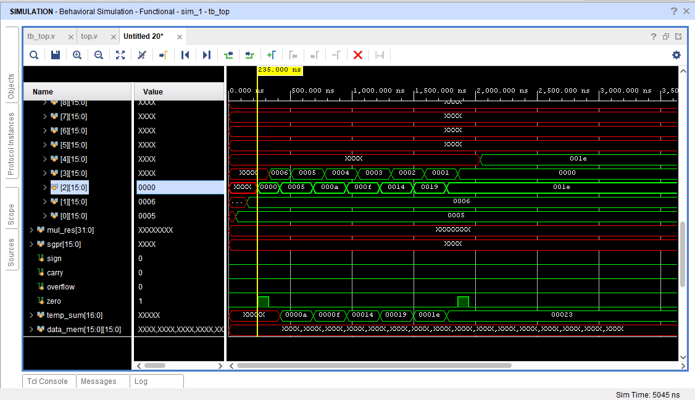

# CUSTOM_RISC_Processor_Design
# 🔧 Custom 16-Bit RISC Processor (RTL + FSM-based Execution)

## 🚀 Project Overview
This project demonstrates a custom-designed 16-bit RISC-style processor written in Verilog HDL. It supports a basic instruction set including arithmetic, logic, memory operations, and conditional jumps using FSM-based control.

## 🧠 Key Features
- Custom 5-stage instruction set
- FSM-based controller
- Supports immediate and register operations
- Instruction memory loading using `$readmemb`
- Flag registers: Zero, Carry, Overflow, Sign
- Behavioral simulation in Vivado

## 🗃️ Directory Structure
- `src/`: Verilog source code
- `memory/`: Instruction memory files (`*.mem`)
- `simulation/`: Screenshots from Vivado
- `docs/`: Diagrams and flowcharts
- `README.md`: Project summary and guide

## 📂 Files Description
| File            | Description                          |
|-----------------|--------------------------------------|
| `top.v`         | Main RTL design                      |
| `tb_top.v`      | Testbench with monitoring outputs    |
| `finalmem.mem`  | Instruction set for simulating       |
| `waveform_1.png`| Simulation waveform (data reg)       |
| `waveform_2.png`| FSM and PC tracking                  |

## 🖥️ Simulation Example
Here's an example of computing `6 * 5` using repeated addition:

## 📈 Results
we have verified using a test case by doing a program 
multipling 6 and 5 without using multiplication
we have written the program and we have creates the instruction memeory file with binary codes 
that instrutions are fed to the testbench 
so here are the final register values
- Final values stored in general-purpose registers:
  - `GPR[1] = 6`
  - `GPR[2] = 5`
  - `GPR[3] = 30` ← Result
- Simulation completes successfully and flags update as expected.

## 📌 Technologies Used
- Verilog HDL
- Xilinx Vivado 2024.2
- RTL Design
- FSM-based control
- Custom ISA architecture

## 🧠 Future Scope
- Extend to 32-bit architecture
- Add pipelining
- Implement memory-mapped I/O
- Support UART or VGA output
- Create an assembler/compiler frontend

